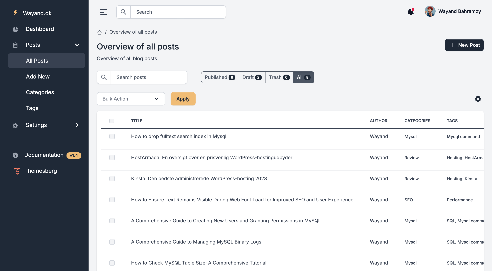

# Wayand.dk - Personal Blog & Portfolio Platform

[](https://www.python.org/downloads/)
[](https://flask.palletsprojects.com/)
[](https://opensource.org/licenses/MIT)

This is the source code of [wayand.dk](https://wayand.dk), my personal blog and portfolio website. The platform is built with Flask and demonstrates my approach to building maintainable, secure, and scalable web applications.

## Screenshots

### Admin Interface - Posts Management


## Technical Overview

This project showcases several modern web development concepts and best practices:

### Architecture
- **Blueprint-based Structure**: Modular application design with separate blueprints for:
  - Blog frontend (`/blog`)
  - Admin interface (`/admin`)
  - RESTful API (`/apiv1`)
- **MVC Pattern**: Clear separation of:
  - Models (SQLAlchemy)
  - Views (Jinja2 templates)
  - Controllers (Flask routes)

### Backend Implementation
- **Authentication**: Secure user authentication using Flask-Login
- **Database**: PostgreSQL with SQLAlchemy ORM
- **Migration Management**: Flask-Migrate for database versioning
- **Form Handling**: Flask-WTF with CSRF protection
- **API Design**: RESTful API endpoints with JSON responses
- **SEO**: Automatic sitemap generation and meta tag management

### Frontend Features
- **Admin Dashboard**:
  - Rich text editing (TinyMCE)
  - Image upload handling
  - Post management (draft/publish workflow)
  - Category and tag management
- **Blog Frontend**:
  - Responsive design
  - SEO-optimized URLs
  - Category and tag filtering
  - Automatic heading anchors

### Security Features
- Password hashing with Werkzeug
- CSRF protection
- Secure session handling
- Environment-based configuration
- Protected admin routes

## Project Structure
```
.
├── app/
│   ├── admin/         # Admin interface blueprint
│   ├── api/          # RESTful API endpoints
│   ├── blog/         # Blog frontend blueprint
│   ├── forms/        # WTForms definitions
│   ├── models/       # SQLAlchemy models
│   ├── static/       # Asset files
│   ├── templates/    # Jinja2 templates
│   └── utils/        # Helper functions
├── migrations/       # Database migrations
└── config.py        # Configuration management
```

## Key Features

### Content Management
- Post creation and editing
- Draft/publish workflow
- Category and tag organization
- Featured image management
- SEO metadata management

### API Endpoints
- `GET /apiv1/posts` - List all posts
- `PATCH /apiv1/posts/<id>/slug` - Update post URL
- `PATCH /apiv1/posts/bulk-trash` - Bulk post management
- `DELETE /apiv1/posts/<id>` - Delete posts
- Protected by authentication

### Admin Interface
- Secure login system
- Dashboard with post analytics
- Content management
- User profile management
- Image upload handling

## Technical Dependencies

- **Python**: 3.8 or higher
- **Flask**: Web framework
- **PostgreSQL**: Database
- **SQLAlchemy**: ORM
- **Flask-Login**: Authentication
- **Flask-Migrate**: Database migrations
- **Flask-WTF**: Forms and CSRF
- **TinyMCE**: Rich text editing

## Local Development Setup

1. Clone and install dependencies:
```bash
git clone https://github.com/wayand/wayand.dk.git
cd wayand.dk/python
python -m venv venv
source venv/bin/activate  # On Windows: venv\Scripts\activate
pip install -r requirements.txt
```

2. Configure environment:
```bash
cp .env.sample .env
# Edit .env with your configuration
```

3. Initialize database:
```bash
flask db upgrade
```

4. Run development server:
```bash
flask run
```

## Production Deployment

The site is deployed on DigitalOcean using:
- Nginx as reverse proxy
- Gunicorn as WSGI server
- PostgreSQL database
- SSL via Let's Encrypt

## Architectural Decisions

- **Flask over Django**: Chosen for its flexibility and lightweight nature
- **Blueprint Structure**: Enables modular development and clear separation of concerns
- **SQLAlchemy**: Provides powerful ORM capabilities and database abstraction
- **TinyMCE**: Rich text editing with code syntax highlighting
- **REST API**: Enables future frontend framework integration

## Contributing

While this is primarily the source code of my personal website, suggestions and improvements are welcome! Feel free to:
1. Fork the repository
2. Create a feature branch
3. Submit a Pull Request

## License

This project is licensed under the MIT License - see the LICENSE file for details.

## Author

[wayand.dk](https://wayand.dk)
